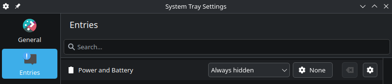

# Simple Battery Plasmoid

A minimal battery indicator widget for KDE Plasma.


## Quick Testing

Test the widget directly without installation:

### Test as a Panel Widget (Compact View)
This simulates the widget in a top panel:

```bash
plasmoidviewer -a . -l topedge -f horizontal
```

### Test as a Desktop Widget (Full View)
This defaults to desktop widget view:

```bash
plasmoidviewer -a .
```

**Note:** If `plasmoidviewer -a .` shows the desktop version, your plasmoid is working correctly. Use the panel command above to test the compact panel representation.

## Installation

### 1. Package the Plasmoid
This creates the installable file from your `package/` directory:

```bash
zip simple-battery-plasmoid.plasmoid package/* -r
```

### 2. Install in Plasma
1. Right-click your panel or desktop → "Add Widgets"
2. Click "Install Widget from Local File" (usually in the menu)
3. Select the `simple-battery-plasmoid.plasmoid` file you created

4. (Optional) Disable the default battery indicator in the system tray settings



**Note:** You might have to log out and in again to your plasma shell for the widget to work correctly.